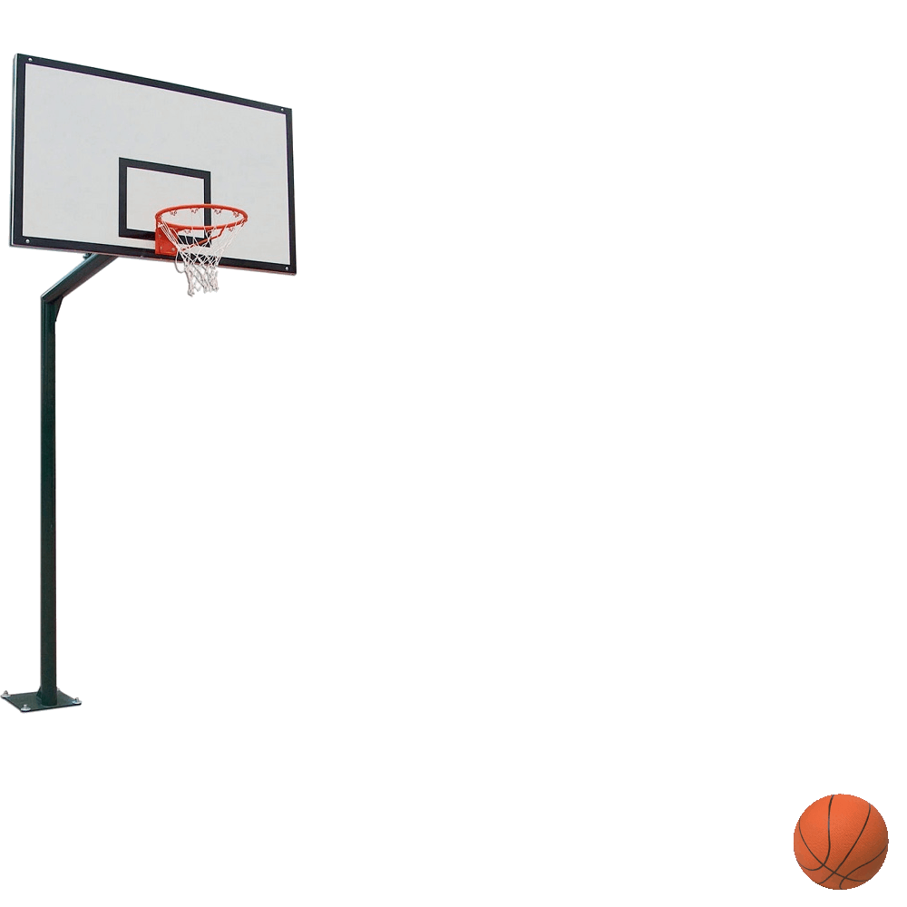

# Conversión de Imágenes a GIF con Photophea

En este repositorio, aprenderemos cómo convertir dos imágenes en un archivo GIF utilizando Photophea, una herramienta de edición de imágenes de código abierto. A continuación, se muestra una breve guía paso a paso para realizar esta conversión.

## Prerrequisitos

Asegúrese de tener Photophea instalado en su sistema. Puede descargarlo desde [el sitio web oficial de Photophea](https://www.photophea.com/).

## Proceso de Conversión

1. Abra Photophea en su sistema.

2. Importe las dos imágenes que desea convertir en GIF. Puede hacerlo utilizando la opción "Abrir" en la barra de menú o simplemente arrastrando y soltando las imágenes en la interfaz de Photophea.

   
   

3. Una vez que las imágenes estén abiertas en Photophea, vaya al menú "Archivo" y seleccione "Exportar como GIF".

4. Aparecerá una ventana de configuración de exportación. Aquí, puede ajustar diferentes parámetros, como la velocidad de fotogramas y la calidad del GIF. Asegúrese de configurarlos según sus preferencias.

5. Haga clic en el botón "Exportar" para iniciar el proceso de conversión.

6. Photophea generará el archivo GIF a partir de las imágenes seleccionadas y los parámetros de configuración que haya elegido.

   

¡Eso es todo! Ahora tiene un archivo GIF creado a partir de las dos imágenes que seleccionó.

## Ejemplo de Resultado

Aquí está el archivo GIF resultante de la conversión de las imágenes de muestra proporcionadas anteriormente:

Siéntase libre de personalizar este proceso según sus necesidades y experimentar con diferentes configuraciones para obtener los resultados deseados. ¡Disfrute creando sus propios GIFs con Photophea!

---

Espero que este README le sea útil, Sr. Cosmin Calin. Si tiene alguna pregunta o necesita más ayuda, no dude en ponerse en contacto.
